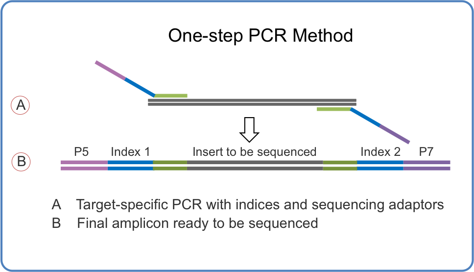
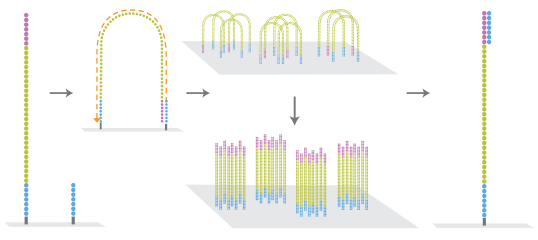

% Quality Control and Data Preprocessing
% [NGS Data Analysis Course](http://ngs-course.github.io/)
% (updated 09-06-2014)

FastQ Format
================================================================================

- Standard Format for NGS data
- Conversion can be done from _sff_, _fasta + qual_, ... 
- Extension of the Fasta format
- Text-based formats (easy to use!)
- If not compressed, it can be huge

\  

<http://en.wikipedia.org/wiki/FASTQ_format>

Quality measurements
================================================================================

Base-calling __error probabilities__ are reported by sequencers.

Usually in __Phred__ (quality) score.

Usually coded by ASCII characters

Phred score
------------

$$Q = -10 log_{10} P$$

$$P = 10^{\frac{-Q}{10}}$$

\ 

<http://en.wikipedia.org/wiki/Phred\_quality\_score#Definition>

NGS Data Preprocessing Steps
================================================================================

- File parsing: convert to __fastq__ format form __sff__, __fasta__ + __qual__ ...
- Split [multiplex](http://www.illumina.com/technology/multiplexing_sequencing_assay.ilmn "Multiplex Sequencing Assay") samples.

- Quality Control of the raw data.

- Filtering and trimming reads by quality.
- Adapter trimming

- Quality Control of the trimmed and filtered reads

Software
================================================================================

- __FastQC__:
    - quality control
    - some filtering ...

[www.bioinformatics.babraham.ac.uk/projects/fastqc](http://www.bioinformatics.babraham.ac.uk/projects/fastqc)

\ 

- __Cutadapt__: 
    - adapter trimming 
	- filter reads by length (short, long)
	- filter reads by quality

<http://code.google.com/p/cutadapt>

<!-- FastQC Images -->

Per Base Sequence Quality
================================================================================

Per Sequence Quality
================================================================================

Per Base Sequence Content
================================================================================

Per Base GC Content
================================================================================

Per Sequence Nucleotide Content
================================================================================

Per Base N Content
===============================================================================

Sequence Length Distribution
===============================================================================

Duplicate Sequences Distribution
================================================================================

Overrepresenteda Kmers
================================================================================

More FastQ examples and documentation
================================================================================

... may be found at [FastQ home page](http://www.bioinformatics.babraham.ac.uk/projects/fastqc/)

- Example Reports

Sequencing process: PCR primers 
================================================================================

Sequencing process: PCR primers 
================================================================================

NGS adaptors and Cutadapt
================================================================================

